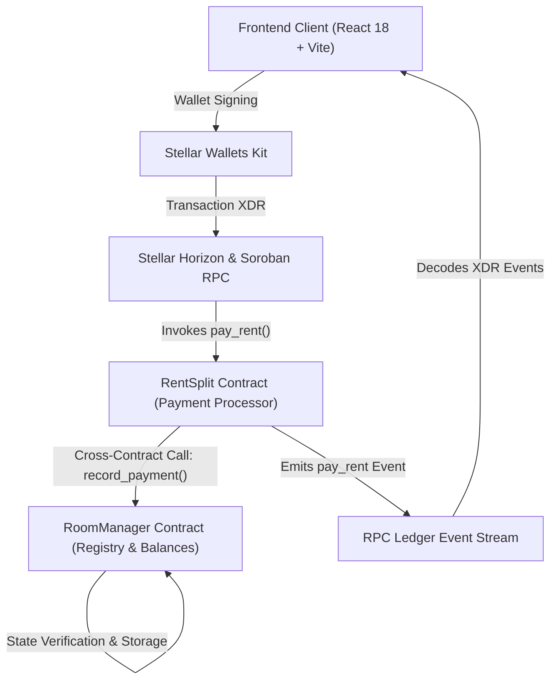

# RentStar Technical Architecture & Smart Contract System

## Overview

RentStar is an enterprise-grade roommate rent settlement dApp built on the **Stellar Testnet** using **Soroban Rust Smart Contracts**. The application separates business logic and state persistence into a modular **Two-Contract Architecture**, enabling decoupled maintenance, independent contract upgrades, and secure cross-contract authorization.

---

## 🏗️ Two-Contract System Architecture

### 1. `RoomManager` Contract (Registry & Balances)
- **Role**: Serves as the central state store for landlord administration, roommate allocations, individual shares, and payment histories.
- **Key Functions**:
  - `initialize(admin: Address)`: Registers the landlord identity.
  - `set_rent_split(rent_split: Address)`: Authorizes the deployed `RentSplit` payment contract.
  - `add_roommate(roommate: Address, share: i128)`: Registers roommate addresses and assigns rent share allocations.
  - `get_share(roommate: Address) -> i128`: Returns a roommate's total rent share.
  - `get_paid(roommate: Address) -> i128`: Returns amount paid by a roommate.
  - `record_payment(roommate: Address, amount: i128)`: Restricted cross-contract entrypoint called by `RentSplit`.

### 2. `RentSplit` Contract (Payment Processor)
- **Role**: Handles payment execution, cross-contract validation, global pool limits, and ledger event emission.
- **Key Functions**:
  - `initialize(room_manager: Address)`: Links the contract to the `RoomManager` registry instance.
  - `pay_rent(payer: Address, amount: i128)`: Validates that `payer` is registered, verifies individual share and global pool limits, invokes `RoomManager.record_payment()`, and emits on-chain payment events.
  - `get_balance(payer: Address) -> i128`: Queries global remaining pool balance.
  - `get_roommate_balance(roommate: Address) -> i128`: Queries individual outstanding roommate balance.

---

## 🔐 Cross-Contract Security & Access Control

1. **Landlord Admin Restriction**: Only the `admin` key stored in `RoomManager` can invoke `add_roommate` and `set_rent_split`.
2. **Authorized Invoker Restriction**: `RoomManager.record_payment` enforces strict `rent_split.require_auth()` authorization. Direct user calls to `record_payment` fail with `Error::NotAuthorized`.
3. **Payer Authorization**: `RentSplit.pay_rent` requires `payer.require_auth()`, ensuring rent contributions can only be initiated by the address owner.

---

## ⚡ Multi-Wallet & RPC Integration Layer

- **Wallet Kit**: Integrates `@creit.tech/stellar-wallets-kit` supporting Freighter, xBull, and Albedo.
- **Mock Mode Simulator**: Allows testing both Landlord and Roommate roles without extension installations.
- **Event Subscriber**: Polling RPC client decodes Soroban XDR event topics (`pay_rent`, `add_room`) in real time to populate the live activity feed and public proof-of-usage page.
